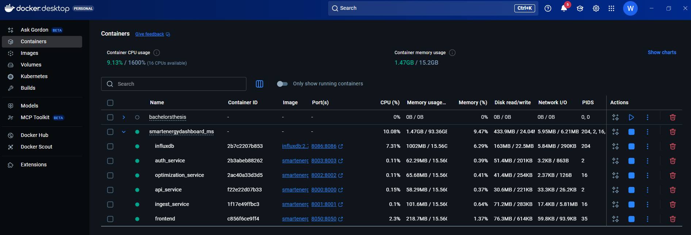

# Advanced Software Engineering (623.503, 25W)
# Smart Energy Dashboard (Microservices)

A robust, local microservice architecture for Home Energy Management using Python, FastAPI, InfluxDB, and Plotly Dash.

## Architecture

The project consists of 5 microservices orchestrated via Docker Compose:

1.  **AuthService (8003)**:
    -   Handles User Registration and Login.
    -   Issues JWT tokens secured with Argon2 password hashing.
    -   Database: Local SQLite (`users.db`).
2.  **IngestService (8001)**:
    -   Imports initial CSV data on startup.
    -   Simulates live energy flow data (PV & Consumption) every 15 seconds.
    -   Writes to InfluxDB.
3.  **OptimizationService (8002)**:
    -   Calculates optimal Battery SoC forecast for the next 24h.
    -   Writes measurements to InfluxDB (`forecast_soc`).
4.  **APIService (8000)**:
    -   Read-only gateway for the frontend.
    -   Aggregates live status, historical timeseries, and forecast data from InfluxDB.
5.  **Frontend (8050)**:
    -   Plotly Dash application.
    -   Login interface.
    -   Live updating graphs for Energy Flow and Battery Forecast.

## Prerequisites

-   Docker Desktop
-   Docker Compose

## Quick Start

1.  **Install**: Follow instructions in `How to install.md`.
2.  **Access**: Open `http://localhost:8050`.
3.  **Login**: Register a new user via API (Postman) or use the CLI script referenced in install guide.

## Development

-   **Code Quality**: Enforced via SonarQube.
-   **Testing**: `pytest` and `pytest-cov`.

## Docker Desktop and Docker Compose

-   **Docker Desktop**: Download and install [Docker Desktop](https://www.docker.com/products/docker-desktop).
-   **Docker Compose**: Download and install [Docker Compose](https://docs.docker.com/compose/install/).

With docker-compose up -d --build, all services will be started in detached mode and you can access the dashboard at http://localhost:8050.
With docker-compose down, all services will be stopped and the containers will be removed.

## Mermaid (Test)
graph TD
    %% User Interaction
    User((User)) -->|Browser: 8050| FE[Frontend - Dash]
    
    %% Authentication Flow
    FE -->|Auth Request| AS[AuthService - 8003]
    AS -.->|JWT Token| FE
    AS --- DB_SQL[(SQLite - users.db)]

    %% Data Retrieval
    FE -->|Data Request + JWT| API[APIService - 8000]
    API -->|Read-only Query| DB_INFLUX[(InfluxDB)]

    %% Backend Processes
    subgraph Data-Engine
        IS[IngestService - 8001] -->|Write Energy Flow| DB_INFLUX
        OS[OptimizationService - 8002] -->|Read Flow / Write SoC Forecast| DB_INFLUX
    end

    %% Styles
    style FE fill:#2c3e50,color:#fff
    style AS fill:#8e44ad,color:#fff
    style IS fill:#27ae60,color:#fff
    style OS fill:#e67e22,color:#fff
    style API fill:#2980b9,color:#fff
    style DB_INFLUX fill:#000,color:#fff